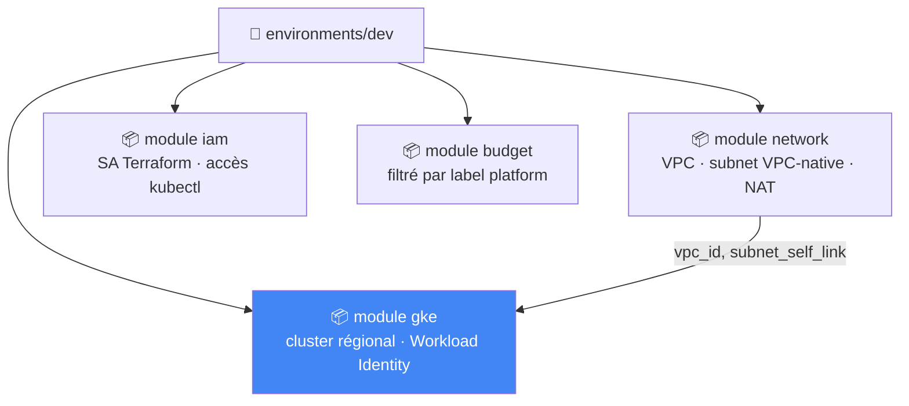
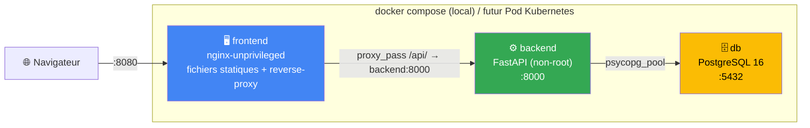
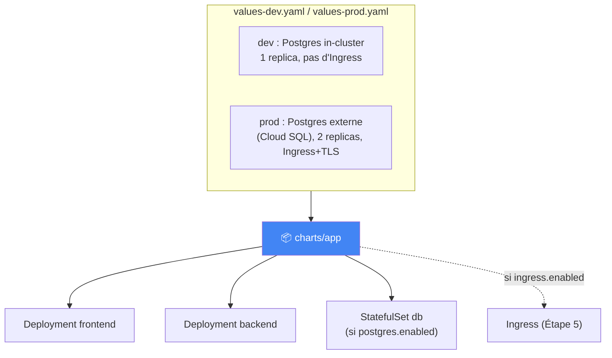
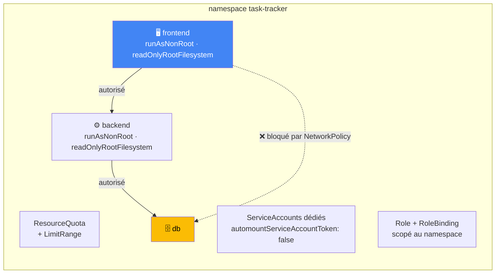
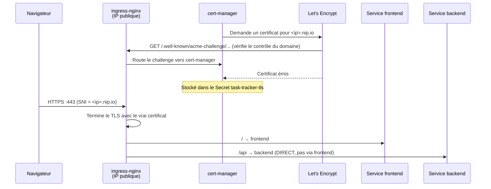
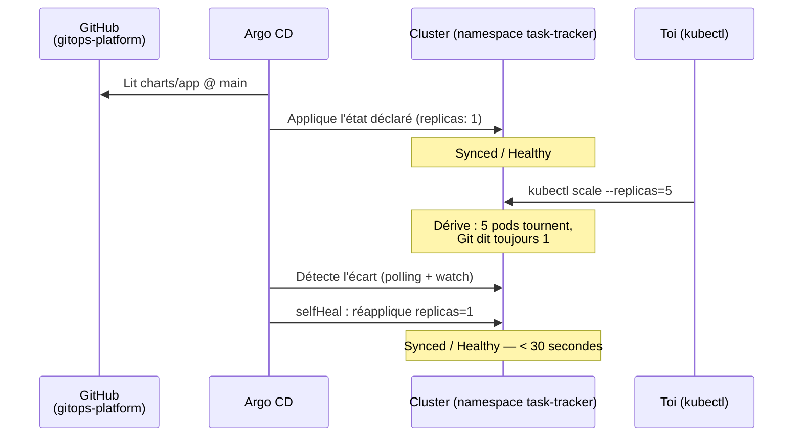
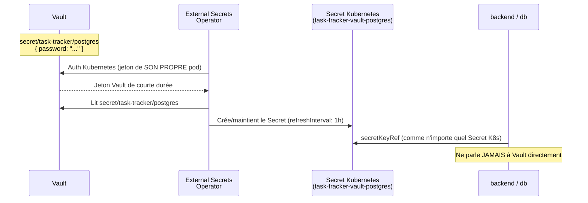
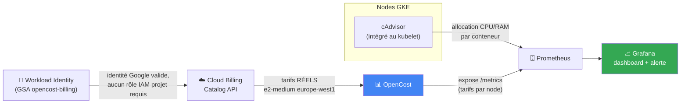

# Kubernetes GitOps Platform

Plateforme applicative 3-tiers, destinée à être déployée sur Kubernetes
uniquement via Git (GitOps), avec un socle de sécurité et une gestion des
secrets propre. Construite en suivant
[Projet-2-Kubernetes-GitOps-Guide.md](Projet-2-Kubernetes-GitOps-Guide.md),
la suite de [Projet 1](https://github.com/amadouldiallo/gcp-platform).

Ce dépôt est **auto-suffisant** : son propre cluster GKE (`terraform/`),
indépendant de celui du Projet 1 — aucune référence croisée entre les deux
dépôts, chacun se clone et se comprend seul.

## Comment lire ce dépôt

Mêmes symboles que le Projet 1 en tête de bloc de commentaire :

| Symbole | Signification |
|---|---|
| 🎯 | Le concept — ce que fait le composant, en langage simple |
| 🧠 | Analogie — pour ancrer le concept dans quelque chose de concret |
| ❓ | Pourquoi c'est important — la conséquence si on s'en passe |
| ⚠️ | Piège — une erreur facile à faire, rencontrée en écrivant ce code |
| 🔭 | Pour aller plus loin — une amélioration volontairement pas faite ici |

## Avancement

| Étape du guide | Dossier(s) | Statut |
|---|---|---|
| — Infrastructure (Terraform) | `terraform/` | ✅ **appliquée pour de vrai** — cluster `gitops-platform` actif sur GCP, voir §Infrastructure |
| 1 — Application de démo | `apps/{frontend,backend,db}/` | ✅ testée en local (`docker compose`) |
| 2 — Docker | `apps/*/Dockerfile` | ✅ multi-stage (backend), non-root, healthchecks — testée |
| 3 — Helm | `charts/app/` | ✅ **déployé et testé sur le vrai cluster GKE** — CRUD complet vérifié, voir §Helm |
| 4 — Socle de sécurité K8s | `k8s/namespace/`, `charts/app/templates/` | ✅ **appliqué et testé sur le vrai cluster** — voir §Socle de sécurité |
| 5 — Ingress & TLS | `k8s/cert-manager/`, `charts/app/templates/ingress.yaml` | ✅ **certificat Let's Encrypt de production réel, testé sans `-k`** — voir §Ingress & TLS |
| 6 — GitOps (Argo CD) | `k8s/argocd/` | ✅ **auto-sync + self-heal testés en conditions réelles** — voir §GitOps |
| 7 — Secrets (Vault + ESO) | `k8s/external-secrets/` | ✅ **plus aucun mot de passe en clair dans Git** — voir §Secrets |
| 8 — FinOps Kubernetes | `k8s/finops/` | ✅ **coût réel par namespace, tarifs GCP réels** — voir §FinOps Kubernetes |

## Infrastructure (Terraform)

`terraform/` provisionne le cluster GKE qui hébergera cette plateforme —
réseau VPC-native dédié, cluster régional privé, Workload Identity, budget
FinOps séparé de celui du Projet 1. Code indépendant du Projet 1 (pas de
`source = "../../cloud-platform/..."`) : ce dépôt reste clonable et
compréhensible seul.



⚠️ **Coût** : un cluster GKE régional facture le control plane et chaque
node en continu — nettement plus qu'une VM de lab. `total_min_node_count`
et `location_policy = "BALANCED"` (voir `modules/gke`) bornent le nombre
de nodes sur l'ensemble des 3 zones plutôt que par zone, mais le coût
reste réel dès le premier `apply`.

⚠️ **Piège de private cluster documenté dans le code** : une règle de
firewall dédiée autorise le control plane à appeler les webhooks
d'admission des opérateurs des étapes suivantes (cert-manager, External
Secrets Operator, Argo CD) — sans elle, leur installation échoue avec des
timeouts opaques, un problème classique des clusters GKE privés.

```bash
cd terraform/environments/dev
cp terraform.tfvars.example terraform.tfvars   # project_id, billing_account_id, admin_email...
cp backend.hcl.example backend.hcl             # ton bucket de state
terraform init -backend-config=backend.hcl
terraform plan     # 20 to add, 0 to change, 0 to destroy — testé contre un vrai projet GCP
terraform apply
```

⚠️ **Ce cluster est actuellement appliqué et actif** (`terraform apply`
réellement exécuté, cluster `gitops-platform`, europe-west1) — il facture
en continu tant qu'il existe. `terraform destroy` depuis
`terraform/environments/dev` le supprime proprement quand tu as fini de
travailler dessus.

## Architecture (Étapes 1-2)



**Pourquoi le frontend proxifie `/api/` vers le backend** (voir
`apps/frontend/nginx.conf.template`) plutôt que d'appeler le backend directement
depuis le navigateur : le code JS (`app.js`) appelle un chemin relatif
(`/api/tasks`), qui fonctionnera à l'identique une fois derrière
l'Ingress Kubernetes de l'Étape 5 (`/` → frontend, `/api` → backend) —
aucun changement de code entre le dev local et la prod.

**Deux endpoints de santé distincts** (`/healthz` et `/readyz` sur le
backend, voir `apps/backend/app/main.py`) — posés dès maintenant car ils
deviendront directement les `livenessProbe`/`readinessProbe` du Helm
chart à l'Étape 3 :
- `/healthz` (liveness) : le process tourne, ne dépend jamais de la base.
- `/readyz` (readiness) : peut servir du trafic MAINTENANT, dépend de la base.

## Helm (Étape 3)

`charts/app` template les 3 tiers en manifests Kubernetes. Déployé pour de
vrai sur le cluster GKE `gitops-platform` (pas seulement `helm
lint`/`helm template`) et testé en conditions réelles : CRUD complet via
`kubectl port-forward`, exactement le même test qu'en local avec `docker
compose`.



**`postgres.existingSecret` plutôt qu'un mot de passe en clair dans
`values-prod.yaml`** : ce chart ne gère JAMAIS lui-même le Secret en prod
— il attend qu'un Secret existe déjà (créé par l'ExternalSecret de
l'Étape 7). En dev, un Secret de convenance est généré depuis
`--set postgres.password=...`, jamais commité — voir
`charts/app/templates/backend-secret.yaml`.

**Trois bugs réels trouvés en déployant sur le vrai cluster** (aucun des
trois n'apparaît avec `helm lint`/`helm template` seuls — la vraie
validation a été de déployer pour de vrai) :

1. **Nom de service différent entre `docker compose` et Kubernetes.**
   `nginx.conf` codait en dur `proxy_pass http://backend:...` (le nom du
   service dans `docker-compose.yml`) — sur Kubernetes, le Service
   s'appelle `task-tracker-backend`. Le frontend partait en
   `CrashLoopBackOff` avec "host not found in upstream". Corrigé en
   transformant `nginx.conf` en `nginx.conf.template` (mécanisme
   `envsubst` déjà intégré à l'image nginx officielle), avec
   `BACKEND_HOST`/`BACKEND_PORT` fournis en variables d'environnement —
   valeurs par défaut dans le Dockerfile pour `docker compose`, surchargées
   par le chart Helm pour Kubernetes. Même image Docker, deux
   environnements.
2. **`initdb` refuse un volume Kubernetes non vide.** Un
   PersistentVolume GKE fraîchement monté contient déjà un dossier
   `lost+found` (créé par le système de fichiers du disque sous-jacent) —
   `initdb` refuse d'y initialiser une base. Corrigé en pointant `PGDATA`
   vers un sous-dossier du point de montage (`/var/lib/postgresql/data/pgdata`),
   la solution documentée par l'image officielle `postgres` pour ce cas
   précis.
3. **Tag flottant `latest` + `imagePullPolicy: IfNotPresent`.** Un node
   qui a déjà mis en cache une image sous un tag donné ne la re-tire
   JAMAIS, même après un nouveau `docker push` du même tag — il continue
   silencieusement de faire tourner l'ancien contenu. `values-dev.yaml`
   force désormais `pullPolicy: Always` (cohérent avec des tags flottants
   qu'on pousse en boucle pendant qu'on développe) ; `values-prod.yaml`
   garde `IfNotPresent` par défaut, adapté à des tags immuables (le SHA
   d'un commit Git, par exemple).

## Socle de sécurité (Étape 4)

`k8s/namespace/` (appliqué séparément du chart Helm, `kubectl apply -f`,
pas un template de `charts/app`) déploie le namespace `task-tracker` et
tout ce qui l'encadre. Testé pour de vrai sur le cluster : rebasculer la
release Helm de `default` vers ce namespace, puis vérifier que ce qui doit
être bloqué l'est vraiment.



**Deux découvertes réelles, faites en testant sur le cluster** (aucune ne
se serait vue à la simple lecture des manifests) :

1. **`capabilities.drop: ["ALL"]` casse Postgres.** L'image officielle
   `postgres` démarre en root pour ajuster les permissions du volume de
   données (`chown`), puis bascule elle-même vers l'utilisateur `postgres`
   via `gosu` — un mécanisme interne à son entrypoint. Retirer TOUTES les
   capacités Linux retire aussi celles (`CAP_CHOWN`, `CAP_SETUID`...) dont
   ce mécanisme a besoin, même si le conteneur démarre encore en UID 0. Le
   pod partait en `CrashLoopBackOff` avec `chmod: Operation not permitted`.
   Corrigé en retirant ce `drop` pour le seul conteneur `db` (voir le
   commentaire dans `charts/app/templates/db-statefulset.yaml`) — le
   frontend et le backend, eux, le gardent sans problème.
2. **Les `NetworkPolicy` n'étaient tout simplement pas appliquées.** Un
   premier test (un pod labellisé "frontend" qui parvenait quand même à
   joindre Postgres) a révélé que ce cluster GKE, créé sans
   `datapath_provider`, n'active PAS l'application des NetworkPolicy par
   défaut — les objets existent dans l'API, `kubectl apply` les accepte,
   mais rien ne les fait respecter. Corrigé en ajoutant
   `datapath_provider = "ADVANCED_DATAPATH"` (GKE Dataplane V2, basé sur
   Cilium) dans `terraform/modules/gke/main.tf` — un champ qui force la
   RECRÉATION complète du cluster (`terraform plan` l'indique clairement :
   `must be replaced`). Fait pour de vrai (~10 minutes) ; le test refait
   ensuite a confirmé le blocage. Piège Terraform annexe découvert au
   passage : le node pool, lui, n'a PAS été recréé dans le même `apply`
   (ses propres arguments n'avaient pas changé, Terraform n'a donc pas vu
   de raison de le toucher) — un second `terraform apply` a été nécessaire
   pour le recréer après coup.

**Ce qui est vérifié, concrètement, sur le vrai cluster** :
- `kubectl exec` dans un pod labellisé `frontend` → connexion directe à
  `task-tracker-db:5432` → **timeout** (bloqué).
- Le même test depuis un pod labellisé `backend` → **connexion acceptée**.
- `kubectl auth can-i delete namespaces --as=<toi> -n task-tracker` → `no`.
- `kubectl describe resourcequota` reflète la consommation réelle des 3 pods.

## Ingress & TLS (Étape 5)

`ingress-nginx` (Ingress Controller, via son chart Helm officiel) et
`cert-manager` sont installés sur le cluster, avec deux `ClusterIssuer`
Let's Encrypt (`k8s/cert-manager/clusterissuers.yaml`). Pas de nom de
domaine acheté pour ce projet : le domaine de test utilise
[nip.io](https://nip.io) (`<ip-avec-tirets>.nip.io` résout automatiquement
vers cette IP) — un vrai domaine publiquement résolvable, ce qui permet un
vrai challenge HTTP-01 et un vrai certificat, pas une simulation.



**Deux bugs réels, encore une fois trouvés en testant, pas en lisant le YAML** :

1. **Nodes saturés en mémoire.** `ingress-nginx` restait `Pending`
   ("Insufficient memory") : les 3 nodes `e2-small` tournaient déjà à
   87-97 % de mémoire ALLOUÉE (namespace `kube-system` + cert-manager +
   l'appli), et `total_max_node_count = 3` empêchait l'autoscaler d'ajouter
   un 4ᵉ node. Corrigé en relevant cette borne à 4 dans
   `terraform/modules/gke/variables.tf` — un choix délibérément marginal
   (pas un passage à un `machine_type` plus gros) pour garder le coût
   incrémental le plus bas possible.
2. **Le NetworkPolicy de l'Étape 4 bloquait l'Ingress lui-même.**
   `/api` route DIRECTEMENT vers le Service backend (demandé explicitement
   par le guide) — mais la NetworkPolicy `backend-allow-from-frontend` ne
   laissait passer QUE les pods labellisés "frontend". Le pod du
   contrôleur ingress-nginx, qui n'a pas ce label, se faisait bloquer
   silencieusement : `504 Gateway Time-out` côté navigateur, sans le
   moindre indice réseau dans les logs applicatifs. Corrigé en ajoutant un
   second `from` à la policy, ciblant le namespace `ingress-nginx` via son
   label automatique `kubernetes.io/metadata.name` (posé par Kubernetes
   depuis la 1.21, pas besoin de le créer à la main).

**Vérifié pour de vrai, sans rien simuler** :
```bash
curl https://34-34-138-87.nip.io/healthz   # sans -k : la confiance doit être native
openssl s_client -connect <ip>:443 -servername <ip>.nip.io \
  | openssl x509 -noout -issuer
# issuer=C=US, O=Let's Encrypt, CN=YR1   (pas "STAGING")
```
Le passage `letsencrypt-staging` → `letsencrypt-prod` a été fait
volontairement en deux temps : valider tout le flux (Ingress, DNS,
challenge HTTP-01) avec `staging` d'abord (aucune limite de taux
préoccupante), puis seulement ensuite basculer vers `prod` — voir le
commentaire dans `k8s/cert-manager/clusterissuers.yaml` pour pourquoi
inverser cet ordre est risqué.

⚠️ **Coût supplémentaire** : le contrôleur `ingress-nginx` crée un Network
Load Balancer GCP (facturé en continu, indépendamment du trafic) en plus
du 4ᵉ node ajouté ci-dessus — les deux s'ajoutent au budget FinOps déjà en
place (`module.budget`, filtré par `platform=kubernetes-gitops`).

## GitOps avec Argo CD (Étape 6)

`k8s/argocd/application.yaml` (commité dans ce dépôt — voir
[github.com/amadouldiallo/gitops-platform](https://github.com/amadouldiallo/gitops-platform))
déclare une `Application` Argo CD qui pointe vers `charts/app` sur la
branche `main`, avec `prune` et `selfHeal` activés. Argo CD (Dex,
notifications et ApplicationSet désactivés — pas nécessaires ici, empreinte
mémoire réduite) tourne sur le cluster et réconcilie ce namespace en continu.



**Testé pour de vrai, pas juste décrit** :
1. Premier `kubectl apply` de l'`Application` → `Synced / Healthy`
   immédiatement, sans conflit — Argo CD a adopté proprement les
   ressources déjà déployées manuellement aux Étapes 3-5 (même nom de
   release, même namespace).
2. `kubectl scale deployment task-tracker-backend --replicas=5` → dérive
   introduite avec succès (`1/5` confirmé par `kubectl get deployment`).
3. Moins de 30 secondes plus tard : nouvelle synchronisation automatique
   déclenchée par Argo CD (`OperationStarted` dans `kubectl describe
   application`), replicas ramenés à 1, pods de trop supprimés — sans
   AUCUNE intervention manuelle.
4. L'application reste joignable et les données déjà créées (tâches des
   étapes précédentes) survivent intactes à tout ce cycle.

✅ **Dette résolue depuis** : `postgres.password` en clair dans
`k8s/argocd/application.yaml` a disparu à l'Étape 7 — voir §Secrets pour
le détail.

## Secrets — Vault + External Secrets Operator (Étape 7)

Vault (mode **dev** — stockage en mémoire, à documenter comme tel, voir
`k8s/external-secrets/vault-setup.md`) et External Secrets Operator
tournent sur le cluster. `k8s/external-secrets/` déclare un
`ClusterSecretStore` (auth Kubernetes — ESO présente le jeton de son
propre pod, aucune clé Vault statique nulle part) et un `ExternalSecret`
qui maintient un vrai Secret Kubernetes synchronisé depuis Vault.



`charts/app/templates/backend-secret.yaml` (Étape 3) était déjà prêt pour
ce jour : `postgres.existingSecret` renseigné, ce template ne crée plus
rien lui-même (voir sa condition `{{- if not .Values.postgres.existingSecret }}`).

**Testé pour de vrai, en trois temps** :
1. `ClusterSecretStore` → `Valid / Ready` ; `ExternalSecret` →
   `SecretSynced` ; le Secret `task-tracker-vault-postgres` contient bien
   la valeur stockée dans Vault.
2. `k8s/argocd/application.yaml` mis à jour (`postgres.password` supprimé,
   `postgres.existingSecret` ajouté), commité, poussé.
3. Après resynchronisation, `task-tracker-backend` et `task-tracker-db`
   référencent le nouveau Secret, l'ancien (`task-tracker-postgres`,
   géré par le chart) a été **supprimé automatiquement** par `prune:
   true`, et une nouvelle tâche créée via l'API confirme que
   l'authentification Postgres fonctionne toujours — la même valeur
   circule, juste par un chemin différent.

⚠️ **Piège Argo CD réel, rencontré en éditant `k8s/argocd/application.yaml`** :
contrairement à `charts/app` (réconcilié en continu), le `spec` de
l'`Application` elle-même n'est PAS repris automatiquement depuis Git —
`selfHeal` ne s'applique qu'aux ressources que l'Application DÉCRIT, pas à
sa propre définition. Un commit qui modifie ce fichier exige un nouveau
`kubectl apply -f k8s/argocd/application.yaml`, comme au premier
bootstrap. Vécu concrètement : `kubectl describe application` affichait
déjà la nouvelle révision Git, mais les pods continuaient de pointer vers
l'ancien Secret tant que ce `kubectl apply` n'avait pas été refait. Un
`ApplicationSet` ou le pattern "app-of-apps" éliminent cette étape
manuelle résiduelle — hors scope ici.

⚠️ **Dette technique restante, assumée** : Vault tourne en mode dev
(stockage en mémoire — une donnée déjà perdue une fois pendant cette
étape, lors d'un remplacement de node pool). Un Vault de production
demanderait un stockage persistant et un vrai processus de scellement —
hors scope pour ce lab, mais le flux ESO ↔ Vault lui-même (auth
Kubernetes, `ClusterSecretStore`, `ExternalSecret`) reste identique.

## FinOps Kubernetes (Étape 8) — la dernière du guide

`k8s/finops/` déploie OpenCost + Prometheus + Grafana, avec un dashboard
et une alerte provisionnés par ConfigMap (pas cliqués dans l'UI — même
philosophie GitOps que le reste de ce dépôt). Les
`resources.requests`/`limits` cohérents demandés par cette étape sont en
place depuis l'Étape 3/4 (voir `charts/app/values.yaml`) : rien à
ajouter là.



**Le calcul du coût, concrètement** : Grafana ne fait qu'une multiplication
PromQL entre deux familles de métriques exposées par OpenCost —
`container_cpu_allocation`/`container_memory_allocation_bytes` (combien
chaque conteneur consomme, mesuré par cAdvisor) et
`node_cpu_hourly_cost`/`node_ram_hourly_cost` (le tarif GCP réel du node
qui l'héberge), jointes sur le label `node` :

```promql
sum by (namespace) (
  container_cpu_allocation * on(node) group_left() node_cpu_hourly_cost
  +
  container_memory_allocation_bytes / 1073741824 * on(node) group_left() node_ram_hourly_cost
)
```

**Trois bugs réels résolus, dans l'ordre où ils sont apparus** :
1. **`/var/configs: permission denied`.** L'image OpenCost ne peut pas
   écrire à l'endroit où elle voudrait mettre en cache les prix
   téléchargés. Corrigé avec un `emptyDir` monté sur ce chemin précis
   (`extraVolumes`/`extraVolumeMounts` du chart).
2. **`roles/billing.viewer` refusé à l'apply.** Ce rôle n'existe qu'au
   niveau d'un COMPTE de facturation
   (`google_billing_account_iam_member`), pas d'un PROJET — le seul type
   que gère `modules/gke`. Retiré : le catalogue de prix public GCP
   n'exige qu'une identité Google authentifiée, pas un rôle particulier —
   Workload Identity seule (`workload_identity_service_accounts.opencost`
   avec `roles = []`) a suffi une fois la propagation IAM terminée
   (~1 minute, un `403: iam.serviceAccounts.getAccessToken denied`
   transitoire pendant ce délai).
3. **Prometheus ne scrapait pas OpenCost du tout.** Aucune découverte
   automatique par défaut avec ce chart — `node_cpu_hourly_cost`
   renvoyait 0 série dans Prometheus alors que le `/metrics` d'OpenCost,
   lui, l'exposait bien. Corrigé avec un `extraScrapeConfigs` explicite
   pointant directement vers `opencost.opencost.svc.cluster.local:9003`.

**Vérifié pour de vrai** : `node_cpu_hourly_cost` pour `e2-medium` en
`europe-west1` renvoie `0.02399337` $/cœur/heure — le vrai tarif GCP, pas
un défaut générique. La requête PromQL ci-dessus, testée directement sur
Prometheus puis via le proxy interne de Grafana (donc dans les mêmes
conditions qu'un panel réel), renvoie 12 séries avec un coût en dollars
par namespace. La règle d'alerte (`k8s/finops/grafana-alert.yaml`,
namespace `task-tracker` > 0,05 $/h) est chargée et s'évalue
correctement (`inactive`, cohérent avec un coût réel d'environ
0,007 $/h pour ce namespace).

⚠️ **Dette assumée** : pas de canal de notification (email/Slack)
configuré sur l'alerte — elle est visible dans Grafana, mais ne notifie
personne activement. Devise en dollars (celle du catalogue GCP), pas en
euros — un détail de configuration, pas une limite du mécanisme.

## Lancer la stack en local

```bash
cp .env.example .env   # puis éditer PGPASSWORD
docker compose up --build
```

- Frontend : http://localhost:8080
- Health : http://localhost:8080/healthz
- API : http://localhost:8080/api/tasks

Testé de bout en bout (CRUD complet, healthchecks des 3 conteneurs,
utilisateurs non-root vérifiés) avant tout commit.

## Structure

```
kubernetes-gitops/
├── docker-compose.yml   # Stack locale — valide l'architecture AVANT Kubernetes
├── .env.example         # Modèle, à copier en .env (gitignored)
├── apps/
│   ├── frontend/         # Statique (HTML/CSS/JS) + nginx reverse-proxy (template envsubst)
│   ├── backend/          # API FastAPI + PostgreSQL (psycopg_pool)
│   └── db/                # postgres:16-alpine + schéma d'init
├── charts/app/           # Chart Helm (Étape 3) — values-dev.yaml / values-prod.yaml
├── k8s/
│   ├── namespace/         # Socle de sécurité (Étape 4) — appliqué à part du chart Helm
│   ├── cert-manager/      # ClusterIssuer Let's Encrypt (Étape 5)
│   ├── argocd/            # Application Argo CD (Étape 6) — auto-sync + self-heal
│   ├── external-secrets/  # ClusterSecretStore + ExternalSecret (Étape 7) — Vault
│   └── finops/             # Datasource/dashboard/alerte Grafana (Étape 8) — OpenCost
└── terraform/
    ├── environments/dev/  # Point d'entrée terraform init/plan/apply
    └── modules/
        ├── network/        # VPC VPC-native, subnet, NAT
        ├── iam/             # SA Terraform, accès kubectl humain
        ├── budget/          # Budget FinOps filtré par label
        └── gke/             # Cluster régional + Workload Identity
```

## Déployer sur le cluster (namespace sécurisé)

```bash
kubectl apply -f k8s/namespace/00-namespace.yaml
kubectl apply -f k8s/namespace/01-resourcequota.yaml
kubectl apply -f k8s/namespace/02-limitrange.yaml
kubectl apply -f k8s/namespace/03-serviceaccounts.yaml
sed 's/CHANGE-ME@example.com/TON-EMAIL/' k8s/namespace/04-rbac.yaml | kubectl apply -f -
kubectl apply -f k8s/namespace/05-networkpolicy.yaml

helm install task-tracker charts/app -n task-tracker \
  -f charts/app/values-dev.yaml \
  --set imageRegistry=<sortie "artifact_registry" du terraform> \
  --set postgres.password=<mot-de-passe-dev>
```

Pour activer l'Ingress + TLS par-dessus (voir §Ingress & TLS pour le
détail) :

```bash
helm repo add ingress-nginx https://kubernetes.github.io/ingress-nginx
helm repo add jetstack https://charts.jetstack.io
helm install ingress-nginx ingress-nginx/ingress-nginx \
  -n ingress-nginx --create-namespace \
  --set controller.service.type=LoadBalancer
helm install cert-manager jetstack/cert-manager \
  -n cert-manager --create-namespace --set crds.enabled=true

sed 's/CHANGE-ME@example.com/TON-EMAIL/' k8s/cert-manager/clusterissuers.yaml | kubectl apply -f -

IP=$(kubectl get svc ingress-nginx-controller -n ingress-nginx \
  -o jsonpath='{.status.loadBalancer.ingress[0].ip}')
HOST="${IP//./-}.nip.io"   # ou ton propre domaine, avec un vrai enregistrement DNS A

helm upgrade task-tracker charts/app -n task-tracker \
  -f charts/app/values-dev.yaml \
  --set imageRegistry=<sortie "artifact_registry" du terraform> \
  --set postgres.password=<mot-de-passe-dev> \
  --set ingress.enabled=true --set ingress.tls=true \
  --set ingress.host="$HOST" --set ingress.clusterIssuer=letsencrypt-staging
```

Puis Argo CD, pour piloter tout ça depuis Git (voir §GitOps) :

```bash
helm repo add argo https://argoproj.github.io/argo-helm
helm install argocd argo/argo-cd -n argocd --create-namespace \
  --set dex.enabled=false --set notifications.enabled=false --set applicationSet.enabled=false

kubectl apply -f k8s/argocd/application.yaml
```

Puis Vault + External Secrets Operator (voir §Secrets pour le détail et
`k8s/external-secrets/vault-setup.md` pour la configuration Vault) :

```bash
helm repo add hashicorp https://helm.releases.hashicorp.com
helm install vault hashicorp/vault -n vault --create-namespace \
  --set server.dev.enabled=true --set injector.enabled=false

helm repo add external-secrets https://charts.external-secrets.io
helm install external-secrets external-secrets/external-secrets \
  -n external-secrets --create-namespace

# Configuration Vault (auth Kubernetes, policy, secret) — voir
# k8s/external-secrets/vault-setup.md pour le détail commenté

kubectl apply -f k8s/external-secrets/clustersecretstore.yaml
kubectl apply -f k8s/external-secrets/externalsecret.yaml
```

Enfin, OpenCost + Prometheus + Grafana (voir §FinOps Kubernetes pour le
détail) :

```bash
helm repo add prometheus-community https://prometheus-community.github.io/helm-charts
helm install prometheus prometheus-community/prometheus \
  -n prometheus-system --create-namespace \
  --set alertmanager.enabled=false --set prometheus-pushgateway.enabled=false \
  --set server.persistentVolume.enabled=false \
  -f <(echo 'extraScrapeConfigs: |
  - job_name: "opencost"
    static_configs:
      - targets: ["opencost.opencost.svc.cluster.local:9003"]')

helm repo add opencost https://opencost.github.io/opencost-helm-chart
helm install opencost opencost/opencost -n opencost --create-namespace \
  -f <(echo 'extraVolumes:
  - name: opencost-configs
    emptyDir: {}
opencost:
  exporter:
    extraVolumeMounts:
      - name: opencost-configs
        mountPath: /var/configs')

helm repo add grafana https://grafana.github.io/helm-charts
helm install grafana grafana/grafana -n grafana --create-namespace \
  --set persistence.enabled=false --set adminPassword=<ton-mot-de-passe> \
  --set sidecar.datasources.enabled=true --set sidecar.dashboards.enabled=true \
  --set sidecar.alerts.enabled=true

kubectl apply -f k8s/finops/
```

## Guide terminé — et maintenant ?

Les 8 étapes du guide sont construites et testées sur ce cluster, pas
seulement décrites. Comme le note le guide original : le **Projet 3**
(Observability & SRE) s'appuierait directement sur cette plateforme — les
métriques Prometheus déployées ici pour le FinOps en deviendraient le
socle, étendu aux logs et aux traces pour une observabilité complète.

## 🔗 Évolutions liées au Projet 3

Le [Projet 3](https://github.com/amadouldiallo/observability-platform) est
un dépôt **séparé**, mais certaines de ses étapes touchent nécessairement
des ressources qui appartiennent à CE dépôt-ci (l'application, son socle
réseau) — documenté ici pour que ce README reste le reflet exact de ce qui
tourne réellement sur le cluster, pas seulement de ce que ce dépôt
contenait au moment du Projet 2 :

- **Métriques backend** (`apps/backend/app/main.py`,
  `apps/backend/requirements.txt`) : instrumentation
  `prometheus-fastapi-instrumentator`, endpoint `/metrics` exposé. ⚠️ Piège
  rencontré : la version 8.1.0 exige `starlette>=1.0.0`, une version qui
  n'existe pas encore pour la branche de FastAPI épinglée ici (0.115.6,
  qui plafonne `starlette<0.42.0`) — `pip` refusait de résoudre les
  dépendances. Fixé en épinglant `7.1.0`, dont la contrainte
  (`starlette<1.0.0,>=0.30.0`) reste compatible.
- **NetworkPolicy** (`k8s/namespace/05-networkpolicy.yaml`) :
  `backend-allow-from-frontend` autorise désormais aussi le namespace
  `monitoring` du Projet 3, sans quoi son Prometheus se serait heurté au
  même piège déjà documenté plus haut pour ingress-nginx (cible "down",
  sans le moindre message d'erreur explicite).
- **Datasource Grafana** (`k8s/finops/grafana-datasource.yaml`) : l'URL
  pointe maintenant vers `kube-prometheus-stack-prometheus.monitoring` (le
  Prometheus Operator du Projet 3), qui a remplacé le Prometheus "nu"
  utilisé jusqu'ici pour le FinOps — même `uid` fixe conservé, donc
  `k8s/finops/grafana-dashboard.yaml` n'a nécessité AUCUNE modification.
  Testé après bascule : la requête PromQL du panel "coût total du
  cluster" retourne toujours des données réelles.
- **`total_max_node_count`** (`terraform/modules/gke/variables.tf`) :
  fausse piste testée puis annulée (4→5→4) en installant Alloy — voir le
  commentaire du fichier pour l'explication complète (un pod de DaemonSet
  déjà `Pending` reste bloqué même si un nouveau node apparaît ailleurs).
- **Traces OpenTelemetry** (`apps/backend/app/main.py`,
  `apps/backend/requirements.txt`, `charts/app/values.yaml`,
  `charts/app/templates/backend-configmap.yaml`,
  `k8s/argocd/application.yaml`) : `FastAPIInstrumentor` +
  `PsycopgInstrumentor`, export OTLP vers Tempo (Projet 3), conditionnel à
  `tracing.otlpEndpoint` (vide par défaut — ce dépôt reste utilisable sans
  le Projet 3). ⚠️ Piège rencontré : `/readyz` est exclu du traçage HTTP
  mais son `SELECT 1` restait tracé par `PsycopgInstrumentor` — sans
  parent HTTP, chaque appel de la sonde de readiness (toutes les 5s)
  créait une trace orpheline à part entière dans Tempo. Fixé en enveloppant
  cet appel précis dans `suppress_instrumentation()`. Vérifié après coup :
  une trace `GET /api/tasks` contient bien un span enfant `SELECT`
  correctement imbriqué (`parentSpanId` du SELECT = spanId du span HTTP).
- **Bornes d'histogramme de latence** (`apps/backend/app/main.py`) :
  personnalisées à `(0.1, 0.3, 0.5, 1)` — le SLI "latence" du Projet 3
  (Étape 5) demande précisément "% de requêtes sous 300ms", un seuil que
  les bornes par défaut de la librairie (`0.1, 0.5, 1`) ne permettaient
  tout simplement pas de mesurer (un histogramme Prometheus ne peut
  répondre qu'aux seuils qui correspondent à une de ses bornes `le=...`).

## 🔒 Évolutions liées au Projet 4 (DevSecOps)

Le [Projet 4](https://github.com/amadouldiallo/devsecops-platform) sécurise
la chaîne d'approvisionnement de CETTE app — contrairement aux Projets 2/3,
ses Étapes 1-4 (SAST, Trivy, SBOM, Cosign) sont des étapes de **pipeline
CI**, elles vivent donc directement ici, pas dans un dépôt séparé (voir le
README de devsecops-platform pour le détail de cette répartition).

- **`.github/workflows/security-ci.yml`** — premier pipeline CI
  automatisé de ce dépôt (tous les builds précédents avaient été faits à
  la main). Deux jobs parallèles : SAST (Bandit) et
  build→trivy fs→trivy image→SBOM(Syft/SPDX)→push→signature (Cosign
  keyless, par digest).
- **Workload Identity Federation dédié** (`terraform/modules/iam/main.tf`,
  SA `gitops-ci`, scopé au dépôt Artifact Registry `gitops-images`) —
  indépendant de `terraform-runner`, moindre privilège : ce SA ne peut
  QUE pousser des images, rien d'autre.
- ⚠️ **Piège rencontré** : `aquasecurity/trivy-action@0.24.0` (version
  devinée) n'existe pas — la CI échouait dès "Set up job". Les vraies
  versions ont été vérifiées via l'API GitHub plutôt que supposées.
- ⚠️ **3 vraies CVE HIGH trouvées par `trivy image`** dans
  `starlette==0.41.3` (CVE-2025-62727, CVE-2026-48818, CVE-2026-54283) —
  la version était plafonnée bas depuis l'Étape 1 du Projet 3 pour une
  tout autre raison (compatibilité `prometheus-fastapi-instrumentator`).
  Fixé en bumpant `fastapi` (0.141.1) et `starlette` (1.6.0) — ce qui a,
  par la même occasion, levé la contrainte qui forçait
  `prometheus-fastapi-instrumentator` à une version plus ancienne (7.1.0
  → 8.1.0). Vérifié avant de pousser : l'empilement de middlewares OTel
  (Projet 3, Étape 3) reste identique malgré ce saut de version majeure.
- **Vérifié réellement, pas juste "la CI est verte"** : signature Cosign
  vérifiée depuis un poste externe (`cosign verify` avec l'identité exacte
  `https://github.com/amadouldiallo/gitops-platform/.github/workflows/security-ci.yml@refs/heads/main`)
  — et vérifié qu'une identité INCORRECTE est bien rejetée (contrôle
  négatif), pas juste que la bonne passe.
